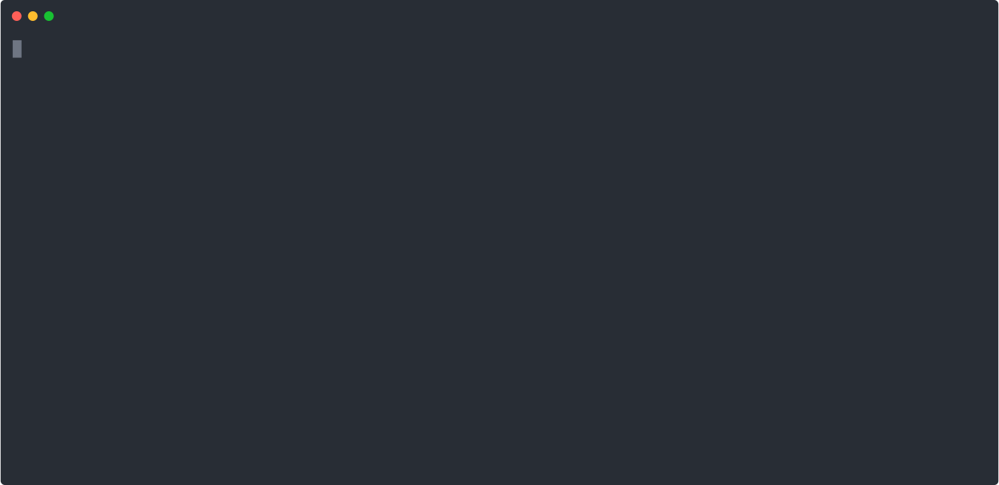

# filt [](https://github.com/k1LoW/filt/releases)

`filt` is a interactive/realtime stream filter ( also known as _"trial-and-error pipe"_ ).



## Usage

``` console
$ tail -F /var/log/nginx/access.log | filt
```

and `Enter` or `Ctrl+C`.

### How to exit from filt prompt

Input `exit` or `Ctrl+C` to prompt.

## Install

**homebrew tap:**

```console
$ brew install k1LoW/tap/filt
```

**manually:**

Download binany from [releases page](https://github.com/k1LoW/filt/releases)

**go get:**

```console
$ go get github.com/k1LoW/filt
```

## References

- [up](https://github.com/akavel/up): up is the Ultimate Plumber, a tool for writing Linux pipes in a terminal-based UI interactively, with instant live preview of command results.
